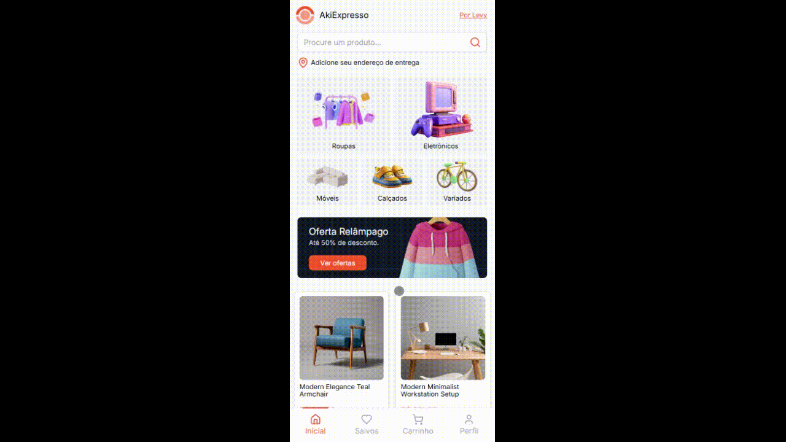

# AkiExpresso

AkiExpresso é um web app de e-commerce desenvolvido para demonstrar habilidades em React, TailwindCSS, React Router e Framer Motion. Criado como um projeto de portfólio, o AkiExpresso destaca o uso de APIs e práticas de desenvolvimento mobile-first.

## 🎯 Objetivo do Projeto

O objetivo principal do AkiExpresso é demonstrar minhas habilidades com React, TailwindCSS e Framer Motion, além de explorar a integração de APIs externas como ViaCEP e a API de produtos fake Platzi. Este projeto contém funcionalidades essenciais de um e-commerce, como carrinho, wishlist, checkout e a capacidade de manipular endereços.

- URL: [https://akiexpresso.netlify.app/](https://akiexpresso.netlify.app/)

## 📸 Demonstrações
**Página Inicial**  

**Carrinho e Checkout**  

**Modal de Endereço e Perfil**  

## 🚀 Funcionalidades

- **Página Home**: Contém um header com campo de busca, botão para adicionar endereço de entrega e um grid de categorias. Na seção de produtos, exibe todos os itens disponíveis.
  - **Modal de Endereço**: Permite ao usuário adicionar ou editar seu endereço de entrega. Ao informar um CEP válido de 8 caracteres, o endereço é automaticamente preenchido utilizando a API ViaCEP. Inputs de telefone e CEP possuem máscaras.
- **Página de Produto**: Ao clicar em um produto, um modal exibe um slider de imagens, nome, preço e descrição do produto. Também inclui dois botões:
  - **Salvar**: Adiciona o produto à página **/wishlist**, onde todos os itens salvos são exibidos.
  - **Adicionar**: Adiciona o produto ao **carrinho** para visualização e edição no checkout.
- **Carrinho de Compras**: Exibe produtos adicionados com a possibilidade de alterar a quantidade. Ao selecionar produtos para checkout, o usuário pode:
  - Alterar o endereço de entrega
  - Escolher entre três opções de envio
  - Adicionar uma mensagem para o vendedor
  - O botão “Finalizar Pedido” é meramente ilustrativo e não realiza uma ação real, já que o projeto é fictício.
- **Página de Perfil**: O usuário pode visualizar seus produtos salvos na wishlist, bem como gerenciar seu endereço de entrega.

## 🧰 Tecnologias Utilizadas

- **React**
- **React Router**
- **TailwindCSS**
- **Framer Motion** para animações
- **API ViaCEP** para preenchimento automático do endereço
- **Fake API Platzi** para listagem de produtos

## 📚 Aprendizado com Integração de APIs

Este projeto proporcionou uma ótima oportunidade para aprender a integração com APIs. Em especial, a API ViaCEP se destacou por ensinar como consumir dados de endereço a partir de um CEP, permitindo preenchimento automático e maior conveniência ao usuário. Adicionalmente, implementei máscaras para os inputs de telefone e CEP, aprimorando a usabilidade dos formulários.

## 🎨 Design e Responsividade

- **Mobile-First**: O design foi feito pensando inicialmente em dispositivos móveis, priorizando uma boa experiência de navegação para telas menores.
- **Responsivo**: Com o auxílio do TailwindCSS, o layout é adaptável para dispositivos de diferentes tamanhos, garantindo uma boa experiência em desktops também.

## 💡 Diferenciais Técnicos

- **Animações com Framer Motion**: Vários elementos da interface, como modais e botões de ação, possuem animações suaves que aprimoram a experiência do usuário, demonstrando cuidado com a UX.
- **Funcionalidades Essenciais de E-commerce**: Carrinho de compras com controle de quantidade, preenchimento automático de endereço e opções de envio, simulando funcionalidades que se esperam em um e-commerce real.
- 
